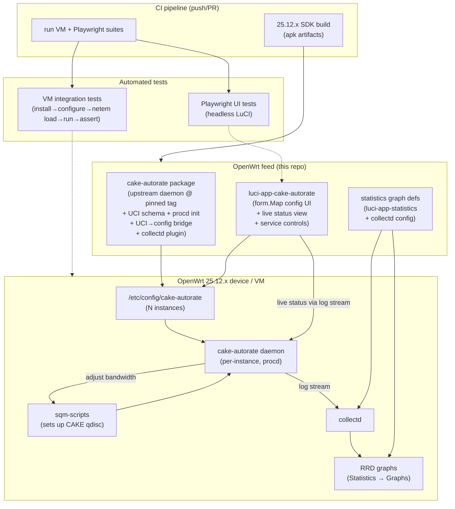
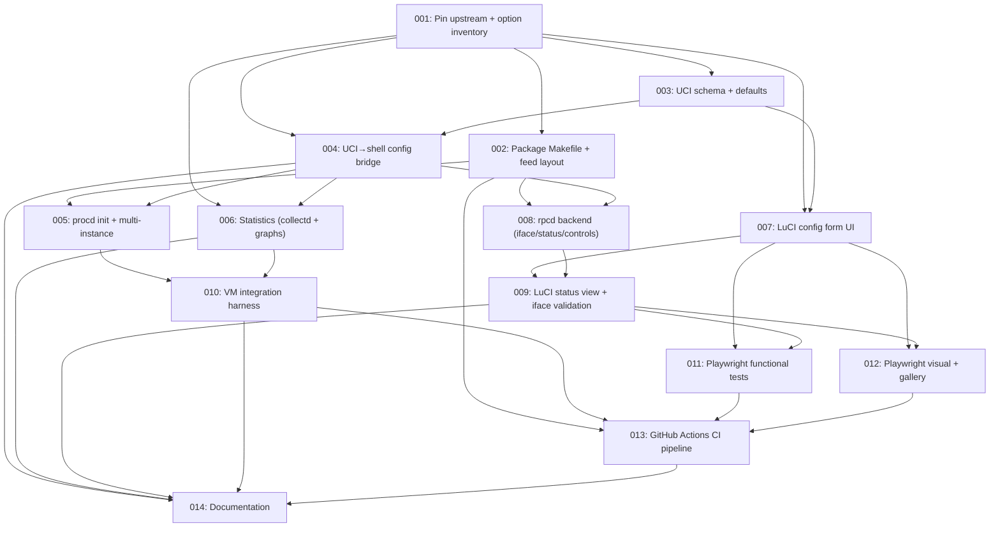

# Plan: OpenWrt Package and LuCI UI for cake-autorate

## Original Work Order
> create an openwrt package for cake-autorate, including a luci ui. We should expose all config options clearly, with appropriate help text or links. We should expose statistics to built in stats like how the sqm cake package does. We have the ability to spawn a vm, so we should set up automated integration tests. For the luci side, we should create playwright tests for the new functionality. Be sure to double check no one else has already done this work.

## Plan Clarifications

| # | Question | Answer |
|---|----------|--------|
| 1 | Has anyone already done this work? | Investigated. Upstream `lynxthecat/cake-autorate` ships only a `setup.sh` installer with plain-shell config — no opkg/apk package, no UCI, no LuCI. One third-party project, `kamikaonashi/openwrt-package-cake-autorate-reborn` ("Darkmoon", v1.0.1, Feb 2026), is an independent **C rewrite** with a LuCI app but no statistics integration and no tests. A full source audit of Darkmoon was performed (see Background). No existing project satisfies the work order. |
| 2 | Which upstream do we wrap? | Upstream `lynxthecat/cake-autorate` (canonical bash implementation). Not Darkmoon. |
| 3 | How does the package relate to sqm-scripts? | Depend on `sqm-scripts`: SQM owns qdisc setup; cake-autorate adjusts CAKE bandwidth. This matches upstream's operating model. |
| 4 | How should "built-in statistics" work? | Custom collectd plugin emitting autorate metrics, plus matching `luci-app-statistics` graph definitions — mirroring how `collectd-mod-sqm` surfaces SQM/CAKE graphs under Statistics → Graphs. |
| 5 | Multi-instance (multi-WAN) support? | Yes, from day one, across UCI schema, init script, LuCI UI, and statistics. |
| 6 | Where does the package live / how is it consumed? | An installable feed in this repository, structured to official `openwrt/packages` and `openwrt/luci` conventions so a future upstream submission is low-friction. |
| 7 | Which OpenWrt target for CI/SDK/VM? | Current stable **25.12.x** (24.10 is now old-stable as of 2026). |
| 8 | Backwards compatibility required? | No pre-existing package exists in this repo, so there is no packaged BC surface to preserve. The package must, however, **import/coexist with an existing manual `/root/cake-autorate/` install** gracefully (documented, not silently migrated). |
| 9 | How far should test automation go — a CI pipeline, or just runnable scripts? | Ship a concrete **CI pipeline** (e.g. GitHub Actions) that runs the 25.12.x SDK build, the VM integration suite, and the Playwright suite on push/PR, in addition to the locally-runnable harnesses. _(User, refinement 2026-07-23)_ |
| 10 | Documentation scope? | README (feed) + user-facing config/option reference + testing doc + a repo `AGENTS.md`. The standalone "upstream-submission notes" document is dropped; any submission guidance folds into the README/AGENTS.md. _(User, refinement 2026-07-23)_ |
| 11 | What runtime interface does upstream expose for the live status view and metrics? | A rotating **log stream** — periodic DATA/SUMMARY lines carrying load condition, per-direction OWD/delay, achieved rate, and shaper rate — **not** a structured status/JSON file. (The JSON status file was Darkmoon's own addition, which wrapping upstream does not inherit.) The LuCI status view and the collectd metric source therefore consume this log stream; whether via a tail parser or a thin, clearly-scoped status shim is decided at design. No change to the shaping algorithm. _(Auto-resolved: upstream source + domain knowledge, refinement 2026-07-23)_ |
| 12 | How will the VM test observe a shaping effect with no real WAN? | The integration harness must **induce controlled WAN conditions** (e.g. `netem` delay/loss on the test link, or a controllable reflector) so the control loop actually moves the CAKE bandwidth; without induced load the daemon stays at base rate and the shaping assertion can never fire. _(Auto-resolved: grounded in cake-autorate control-loop behavior, refinement 2026-07-23)_ |
| 13 | Which package format does target 25.12.x use? | **apk** — OpenWrt's post-24.10 release line defaults to the apk package manager, superseding opkg. The Makefile/`package.mk` feed is format-agnostic and the SDK emits the correct artifact, but install commands in the tests, CI, and docs must be apk-aware (`apk add`), not `opkg install`. Confirm the target image's default manager when the point release is pinned. _(Auto-resolved: OpenWrt release/tooling direction, refinement 2026-07-23)_ |
| 14 | Should Playwright capture LuCI screenshots for visual diffs and human UI review? | **Yes**, as two distinct purposes. The Playwright suite captures **full-page screenshots of every LuCI page/tab and key state** and (a) runs **visual-regression diffs** against committed baselines to catch UI changes, and (b) publishes a **browsable human-review gallery** so the maintainer can evaluate the actual UI (layout, help text, tab structure) from CI artifacts without a device. Because the live status view shows changing values, dynamic regions are masked so diffs register only structural/visual change; the gallery — not strict pixel equality — is the primary UI-evaluation surface. _(User, refinement 2026-07-23)_ |
| 15 | ~76 options is a lot — how do we keep the UI usable? | Don't present 76 fields in a row. The LuCI UI leads with a small **Essentials** group (interface(s), enable, min/base/max rates per direction) that most users ever touch, backed by **defaults sane enough that a working setup needs only those fields edited**. The remaining options are organized into **logically grouped, collapsible sections** (Rates, Delay/EWMA & baselines, Reflectors, Bufferbloat detection, Idle/sleep & stalls, Logging/output, Timers) with a **search/filter** to jump to a named option. _(User, refinement 2026-07-23)_ |
| 16 | How do we avoid the interface-mapping trap (daemon runs but shapes nothing)? | The UI does **not** take blind free-text interfaces. It **derives and validates the shaping interfaces from the live SQM configuration** — the WAN egress device and the corresponding ingress **IFB** (`ifb4*`) that SQM created — presenting them as validated choices and warning on a mismatch, so cake-autorate always targets the qdisc SQM actually built. _(User, refinement 2026-07-23)_ |
| 17 | Compiled collectd plugin, or stay architecture-independent? | **Architecture-independent, committed.** No compiled C code ships: the daemon/bridge are shell, the LuCI app is JS/Lua, and statistics use collectd's **tail/exec** mechanism (config + script), not a compiled plugin. Packages are marked `PKG_ARCH:=all`, so a **single SDK build installs on every 25.12.x target** with no per-architecture matrix. (Refines the "custom collectd plugin" wording of #4 to mean tail/exec, not compiled.) _(User, refinement 2026-07-23)_ |
| 18 | How do we guarantee the stats/status feed is never empty? | The package **controls cake-autorate's own output configuration**: the config bridge always pins the logging/output options the parser depends on (required DATA/SUMMARY fields, stable format, known per-instance path), rather than leaving stats at the mercy of user-set log verbosity. A default install therefore produces a populated status view and populated graphs without manual tuning; those parser-critical output settings are package-managed. _(User, refinement 2026-07-23)_ |
| 19 | Which CI system does the pipeline target? | **GitHub Actions.** The feed is intended to live on GitHub, and the Component 8 pipeline is authored as a GitHub Actions workflow. This repo currently has **no git remote**, so publishing the feed to a GitHub repository is a documented prerequisite for the pipeline to run (it is not itself a code deliverable). GitHub-hosted Ubuntu runners now expose `/dev/kvm`, so the VM integration job targets standard hosted `ubuntu` runners with a KVM-capable self-hosted runner as fallback. _(User, refinement 2026-07-23)_ |

## Executive Summary

This plan delivers a first-class OpenWrt integration for cake-autorate: a buildable package feed that installs the canonical upstream bash daemon under service management, a UCI configuration layer, a LuCI web application exposing every supported configuration option with help text and upstream documentation links, historical statistics through collectd and `luci-app-statistics`, and two automated test suites — VM-based integration tests and Playwright UI tests.

The approach wraps upstream `lynxthecat/cake-autorate` rather than reimplementing its algorithm. Upstream is the field-proven implementation the community runs; it supports all documented options, IPv6, multiple pinger backends, and multi-WAN. A prior-art audit of the only competing packaged effort (the "Darkmoon" C rewrite) found eight configuration options exposed in its UI but never read by its daemon, no IPv6, a broken multi-instance status path, and no tests — confirming that wrapping upstream is both the lower-risk and higher-fidelity path. Darkmoon's LuCI information architecture (a four-tab option layout with well-written help text) is a useful, license-compatible reference for our UI, and this plan reuses that structure while binding every field to an option upstream actually implements.

The expected outcome is a cohesive, installable, testable package set — `cake-autorate`, `luci-app-cake-autorate`, and statistics graph definitions — that a user installs from the feed, configures entirely through LuCI, observes through both a live status view and historical RRD graphs, and that maintainers can regression-test automatically in a spawned VM and a headless browser, all wired into a CI pipeline that builds the feed and runs both suites on every change.

Two facts about wrapping upstream shape the design and are made explicit throughout this plan. First, upstream's runtime interface is a **log stream** (periodic DATA/SUMMARY lines), not a structured status file — the JSON status file was Darkmoon's own addition, which this plan does not inherit — so the live-status view and the collectd metric source both consume that log stream. Second, cake-autorate only moves bandwidth in response to congestion, so the VM integration test must **induce load** (e.g. `netem`) or the daemon will sit at base rate and the shaping assertion can never fire.

## Context

### Current State vs Target State

| Current State | Target State | Why? |
|---|---|---|
| cake-autorate is installed via an upstream `setup.sh` that drops files under `/root/cake-autorate/` | Installed as a versioned OpenWrt package from a feed, with files under standard FHS/OpenWrt paths | Package management, clean upgrade/removal, reproducible builds, and eligibility for upstream feeds |
| Configuration is hand-edited shell files (`config.primary.sh`, `config.secondary.sh`) | Configuration in UCI (`/etc/config/cake-autorate`), one section per instance | UCI is the OpenWrt-native config system and the prerequisite for a LuCI UI |
| No web UI; users edit files over SSH | A LuCI app that leads with Essentials (interface + rates) and organizes every supported option into grouped, collapsible, searchable sections with help text and doc links; interfaces validated against SQM; plus a live status view and service controls | The work order requires a LuCI UI that exposes all options *clearly* — grouping + defaults make ~76 options usable |
| No historical metrics; upstream only writes a rotating **log stream** (periodic DATA/SUMMARY lines) to a log file — no structured/JSON status file | Autorate metrics fed to collectd (arch-independent tail/exec) with `luci-app-statistics` graph definitions, guaranteed populated because the package controls the daemon's output | The work order requires built-in statistics "like the sqm cake package does" |
| Service run manually or via upstream's own init glue | procd-managed service, one instance per configured UCI section, auto-start on boot | Standard OpenWrt service lifecycle; required for multi-instance |
| No automated tests | Automated VM integration tests + Playwright LuCI UI tests, pinned to 25.12.x, run by a CI pipeline (SDK build + VM + Playwright) on push/PR | The work order requires both; needed for maintainability and upstream review |
| No packaged version exists (only a third-party C rewrite) | An independent, upstream-faithful package set in this repo, upstream-submission-ready | Fills the confirmed gap without depending on the unvalidated C rewrite |

### Background

**Prior-art investigation (work-order requirement).** A web and source-level search established:

- **Upstream `lynxthecat/cake-autorate`** — the canonical implementation. Installs via `setup.sh`; configuration is plain shell (`config.primary.sh`, additional instances as `config.<name>.sh`); dependencies are `bash` and a pinger (`fping` by default, also `fping-ts`, `tsping`, `irtt`, `ping`). It expects the CAKE qdisc to already exist (i.e. set up by `sqm-scripts`) and adjusts its bandwidth. It exposes ~76 configuration variables spanning interfaces, rates, delay thresholds, EWMA/baseline parameters, rate-adjustment multipliers, bufferbloat detection windows, reflector management/health, logging, and pinger selection. Its **runtime interface is a rotating log stream** (periodic DATA/SUMMARY lines carrying load condition, per-direction OWD/delay, achieved rate, and shaper rate) written under `/var/log/` — there is **no structured status/JSON file**. Consequently the live-status view (Component 4) and the metrics path (Component 5) in this plan consume that log stream rather than a status API. No opkg/apk package, no UCI, no LuCI.

- **`kamikaonashi/openwrt-package-cake-autorate-reborn` ("Darkmoon"), v1.0.1, Feb 2026** — an independent C rewrite (not upstream code). It ships an OpenWrt package Makefile (`GPL-2.0-or-later`), a LuCI `form.Map` app with four tabs (General / CAKE Qdisc / Advanced / Reflector Health), a UCI config, a procd init script, and a live Overview widget polling `/var/run/darkmoon.json`. A full source audit found material defects that make it unsuitable as a base: (a) **eight UCI options are parsed and shown in the UI with confident help text but never consumed by the daemon** — `enable_sleep_function`, `sustained_idle_sleep_thr_s`, `min_shaper_rates_enforcement`, `global_ping_response_timeout_s`, `reflector_replacement_interval_s`, `reflector_comparison_interval_s`, `reflector_sum_owd_baselines_delta_thr_ms`, `reflector_owd_delta_ewma_delta_thr_ms`; (b) **no IPv6** (raw `IPPROTO_ICMP` only, all-IPv4 default reflectors); (c) **multi-instance is broken** — the status file path is hardcoded, so a second instance overwrites the first's status ~5×/s; (d) **reflector spare pool is consume-only** (`spare_idx` never resets), exhausting after enough replacements; (e) **no automated tests of any kind**; (f) no statistics/collectd integration. Its live status widget provides an instantaneous readout only — no history, no RRD, no Statistics integration.

- **`collectd-mod-sqm` + `luci-app-statistics`** — the reference pattern named in the work order. `luci-app-statistics` already ships SQM and SQM-Cake graph definitions (openwrt/luci PR #4181), rendering RRD history under Statistics → Graphs. This is the model our statistics integration follows.

**Why wrap upstream rather than adopt Darkmoon.** Darkmoon's apparent head start (a working LuCI app) shrinks under audit: adopting it would require implementing or removing eight features, adding IPv6, and fixing multi-instance before any of the work-order-specific statistics and test work could even begin — all on an unvalidated reimplementation of the control loop. Upstream implements every option for real, supports IPv6 and multi-WAN, and carries years of field use. Darkmoon remains valuable as a **UI reference** (its tab layout and help-text wording are GPL-2.0-compatible and reusable) and its standalone-qdisc design is noted but explicitly not adopted (we depend on sqm-scripts per clarification #3).

**Existing manual installs.** Some users already run upstream via `/root/cake-autorate/`. The package must detect and not clobber such an install, and documentation must explain the relationship and migration path. No automatic migration is in scope.

## Architectural Approach

The deliverable is a feed containing three cooperating package definitions, two test suites, and a CI pipeline that builds the feed and runs both suites. The daemon itself is upstream code fetched at a pinned tag; all OpenWrt-native integration (UCI, procd, LuCI, collectd) is new work authored in this repo. SQM owns the qdisc; cake-autorate adjusts its bandwidth. Every LuCI field maps to a real upstream option; a UCI-to-shell configuration bridge translates the UCI schema into the per-instance config format upstream expects. Because upstream exposes only a **log stream** (not a status file), both the live-status view and the metrics path read from that log stream.

### Component 1 — Package layout and build
**Objective**: Produce an SDK-buildable feed that installs upstream cake-autorate under standard OpenWrt paths, following official `openwrt/packages` and `openwrt/luci` conventions.

The feed defines a `cake-autorate` package whose Makefile fetches upstream at a pinned release tag (source integrity via hash), declares dependencies (`bash`, the chosen pinger backend(s), `sqm-scripts`, and the collectd pieces), and installs the daemon, UCI defaults, procd init script, the UCI-to-config bridge, and the collectd plugin. `luci-app-cake-autorate` is a separate package following luci feed layout (client-side `form.Map` view resources, menu entry, rpcd ACLs). Statistics graph definitions live where `luci-app-statistics` expects contributed graph scripts, with any required collectd configuration shipped alongside. Naming, sections, categories, licensing (`GPL-2.0-or-later`), and maintainer metadata follow upstream feed conventions so a later PR is low-friction. The Makefile/`package.mk` layer is package-manager-agnostic and the 25.12.x SDK emits the target's native artifact format — **apk** for the post-24.10 release line — so no opkg assumptions are baked into the packages; only the *install* commands used by tests, CI, and docs are apk-aware (`apk add`). All three packages are **architecture-independent** — the daemon and bridge are shell, the LuCI app is JS/Lua, and statistics ship as collectd config + a script (no compiled code) — and are marked `PKG_ARCH:=all`, so one SDK build produces artifacts installable on every 25.12.x target with no per-architecture matrix. Version pinning, dependency choices, and the exact split of files across packages are settled during design.

### Component 2 — UCI configuration schema and config bridge
**Objective**: Represent every supported upstream option in UCI, one section per instance, and faithfully translate it into the shell config upstream consumes.

A UCI schema (`/etc/config/cake-autorate`) models each cake-autorate instance as a named section carrying the full option set (interfaces, adjust toggles, min/base/max rates per direction, connection-active threshold, pinger backend and count and interval, reflector list and reflector-management/health parameters, OWD delay thresholds, EWMA/baseline alphas, rate-adjustment multipliers, bufferbloat detection window/threshold/refractory periods, idle/sleep and stall handling, logging/output toggles, startup and interval timers). Because upstream reads per-instance shell config files rather than UCI, a bridge component generates the expected `config.<instance>.sh` (or equivalent) from each UCI section at service start/reload. The schema is the single source of truth; the bridge is deterministic and idempotent. Option names, types, defaults, and any validation/normalization (units, ranges, IPv4/IPv6 reflector handling) are specified during design, cross-checked against the upstream option inventory so no option is silently dropped and none is exposed that upstream does not honor. Two behaviors are fixed here rather than left open: (a) the shaping **interfaces are validated against the live SQM configuration** (WAN egress device + ingress `ifb4*`), not accepted as free text; and (b) the bridge **always pins the logging/output options the metrics parser depends on** to known-good values (required fields, stable format, known per-instance path), so the status view and statistics feed are guaranteed populated regardless of user verbosity settings.

### Component 3 — Service lifecycle (procd, multi-instance)
**Objective**: Run one daemon per enabled instance under procd, with correct start/stop/reload and boot behavior, without disturbing SQM's ownership of the qdisc.

A procd init script iterates configured UCI sections, starting an instance per enabled section, regenerating its shell config via the bridge beforehand, and wiring reload triggers so LuCI "Save & Apply" reliably (re)starts affected instances — including the cold-start case where a service is enabled for the first time. Ordering relative to `sqm` (which must have created the qdisc first) is handled explicitly. Per-instance runtime artifacts (status/log paths) are namespaced by instance so multiple WANs do not collide.

### Component 4 — LuCI application
**Objective**: Expose every supported option clearly with help text and links, provide a live per-instance status view, and offer service controls — for multiple instances.

A `form.Map`-based LuCI app leads with a compact **Essentials** group — the interface(s), enable, and min/base/max rates per direction — that most users ever need, backed by defaults sane enough that a working single-instance setup requires editing only those fields. The full option set is **not** shown as a flat list of ~76 fields; it is organized into **logically grouped, collapsible sections** (Rates, Delay/EWMA & baselines, Reflectors, Bufferbloat detection, Idle/sleep & stalls, Logging/output, Timers) with a **search/filter** to jump to a named option, each with per-option descriptions and links to upstream documentation where a concept needs more than a sentence. It supports creating, editing, enabling, and deleting multiple named instances.

Interface selection does **not** accept blind free text: the app derives and validates the shaping interfaces from the **live SQM configuration** — the WAN egress device and the corresponding ingress **IFB** (`ifb4*`) that SQM created — presenting them as validated choices and warning on a mismatch, so the daemon always targets the qdisc SQM actually built (closing the most common "runs but shapes nothing" failure).

A status view renders live per-instance state (shaped vs. achieved rates, load condition, OWD deltas, active reflectors, uptime), derived from the daemon's **log stream** through an rpcd backend gated by ACLs scoped to the package's UCI and runtime files. The feed is reliable because the package controls cake-autorate's output configuration (see Components 2 and 5) rather than depending on user-set verbosity. Start/Stop/Restart controls are provided via rpcd under the same ACLs. Every field is bound to a real upstream option (per the audit lesson); no decorative controls.

### Component 5 — Statistics integration
**Objective**: Give autorate its own historical graphs under LuCI Statistics, in the same place and style as the SQM/CAKE graphs.

A collectd **tail/exec** integration — configuration plus a small script, deliberately with **no compiled C plugin** so the package stays architecture-independent — exports per-instance autorate metrics (shaper rate and achieved rate per direction, OWD delta per direction, load/bufferbloat state) on collectd's interval, and `luci-app-statistics` graph definitions render those series as RRD graphs under Statistics → Graphs. The metric source is the daemon's **log stream** — the same source the status view uses — avoiding a second measurement path, and it is **reliable by construction**: the config bridge pins cake-autorate's output settings (Component 2) so the fields the parser needs are always emitted in a stable format at a known per-instance path, and graphs are never empty on a default install. `collectd-mod-tail` parsing the DATA/SUMMARY lines is the expected mechanism (a thin exec reader is the alternative); metric naming and multi-instance labeling are decided during design so graphs are per-instance and legible. This complements (does not replace) `collectd-mod-sqm`, which continues to graph the underlying CAKE qdisc.

### Component 6 — Automated VM integration tests
**Objective**: Prove, unattended, that the package installs, configures, runs, shapes, and reports on a real OpenWrt 25.12.x system.

Using the available VM-spawning capability, an integration harness boots an OpenWrt 25.12.x image, installs the built packages (apk) and dependencies including sqm-scripts, applies a known UCI configuration (including a multi-instance case), and starts the service. Crucially, a bare VM has no congestion, so the daemon would otherwise sit at its base rate and never adjust — the harness therefore **induces controlled WAN conditions** (e.g. `netem` delay/loss on the test link, or a controllable reflector) to drive the control loop, then asserts observable outcomes: instances run under procd, the CAKE qdisc bandwidth actually moves in response to the induced load, per-instance runtime status is produced at distinct paths, collectd receives the metrics, and clean stop/removal leaves the system tidy. To stay robust against timing, shaping assertions check the *direction and occurrence* of rate change over a window rather than exact values. The harness is scripted for CI, pinned to 25.12.x, and produces machine-checkable pass/fail with captured evidence (logs, `tc` output, screenshots).

### Component 7 — Playwright UI tests
**Objective**: Regression-test the LuCI functionality in a real headless browser.

Playwright tests drive the LuCI app against a running instance (the VM from Component 6 or an equivalent LuCI environment): loading the config page, exercising each tab, creating/editing/deleting an instance, saving and applying, verifying the status view populates, and exercising the Start/Stop/Restart controls. Tests assert on real DOM/state and are runnable in CI. Selectors and fixtures are chosen for stability against LuCI's client-rendered forms.

**Screenshots serve two distinct purposes.** (1) **Visual-regression diffs** — the suite captures full-page screenshots of each LuCI page/tab and key state (empty config, populated single instance, multi-instance, status view, post-Save-&-Apply) and compares them against committed baselines (e.g. Playwright's `toHaveScreenshot()`), surfacing pixel/layout diffs when the UI changes. To keep diffs meaningful rather than flaky, runs pin the browser engine and viewport and **mask inherently dynamic regions** (live status rates/deltas/uptime, timestamps) so only structural/visual change registers; baselines live in-repo and are refreshed via a documented update command. (2) **Human-review gallery** — the same run publishes a browsable set of labelled, full-page screenshots of every page/tab/state as a CI artifact, so a maintainer can eyeball the real UI without spinning up a device. Whether a visual diff *gates* the build or is merely surfaced for review is a design decision; the human-review gallery is always published.

### Component 8 — CI pipeline
**Objective**: Build the feed and run both test suites automatically on every change, so regressions surface without manual effort — the "automated" in the work order's "automated integration tests."

A **GitHub Actions** workflow (clarification #19) runs on push and pull request with three jobs pinned to a specific 25.12.x point release: (1) **Build** — set up the 25.12.x SDK, build the feed once (packages are architecture-independent, so no per-arch matrix), and publish the resulting apk artifacts; (2) **Integration** — run the Component 6 VM harness (install via apk, apply UCI, induce load, assert shaping/status/stats/removal); (3) **UI** — run the Component 7 Playwright suite headlessly, run the visual-regression comparison against committed baselines, and publish both the diff results and the browsable human-review screenshot gallery as artifacts. Jobs are ordered so the build's artifacts feed the downstream jobs, and each publishes machine-checkable pass/fail plus evidence. The one environmental constraint called out for design is that booting an OpenWrt VM needs nested virtualization/KVM; GitHub-hosted Ubuntu runners now expose `/dev/kvm`, so the integration job targets standard hosted `ubuntu` runners, with a KVM-capable **self-hosted** runner as the documented fallback, and Build + UI kept green independently — with a clear "integration skipped: no KVM" signal (never a silent pass) if a given runner cannot virtualize. Because this repo has **no git remote yet**, publishing the feed to a GitHub repository is a prerequisite for the workflow to run (a documented setup step, not a code deliverable). The workflow YAML syntax, runner selection (hosted-KVM vs. self-hosted), and caching strategy are settled during design.

## Risk Considerations and Mitigation Strategies

Technical Risks

- **UCI↔shell config drift**: The bridge could omit or mistranslate an upstream option, silently degrading behavior.
  - **Mitigation**: Drive the schema from a complete, checked inventory of upstream options; add a bridge-level assertion/test that every UCI option maps to a generated config key and vice versa; cover it in VM integration tests.
- **Upstream option set changes at the pinned tag**: A future upstream bump could add/rename/remove options, breaking the bridge or UI.
  - **Mitigation**: Pin to a specific tag with a source hash; make option coverage a test so a bump surfaces mismatches immediately; document the upgrade procedure.
- **Qdisc ownership conflict with sqm-scripts**: If cake-autorate and SQM disagree about who owns the qdisc, shaping breaks.
  - **Mitigation**: Follow upstream's model exactly (SQM sets up, autorate adjusts), enforce start ordering in procd, and assert the interaction in the VM test.
- **Log-stream is the only runtime interface**: Both the live-status view and the collectd metrics parse upstream's log DATA/SUMMARY lines; if that log format changes across upstream versions, status and stats break together, and there is no structured status file to fall back on.
  - **Mitigation**: The package **controls cake-autorate's output configuration** (the config bridge pins the logging/output options the parser needs), so the feed is always present and in a known format at the pinned tag — a version bump is the only thing that can move it, and that is caught by a parsed-field-set contract test. Pin to a specific upstream tag; keep the parser thin and shared between the status backend and the collectd source.
- **Interface-mapping misconfiguration**: If the daemon is pointed at the wrong interface — classically the WAN egress instead of the ingress IFB that SQM created — it runs but shapes nothing, a silent failure that reads as "broken."
  - **Mitigation**: Derive and validate the shaping interfaces from the live SQM configuration in the UI (egress + `ifb4*` ingress); warn on mismatch; assert real shaping in the VM integration test.
- **IPv6 reflector handling**: Mixed IPv4/IPv6 reflector lists must pass through UCI→config correctly.
  - **Mitigation**: Specify reflector validation/normalization in the schema design and cover a v6 case in tests.

Implementation Risks

- **Option overload**: ~76 fields shown flat would overwhelm a non-expert and make the UI effectively unusable — the opposite of the work order's "expose all options *clearly*."
  - **Mitigation**: Lead with an Essentials group and sane defaults so a minimal config needs only interface + rates; organize the rest into logical collapsible sections with search; cover the essentials-only path in a Playwright test.
- **LuCI client-rendered forms make Playwright selectors brittle**: Tests could flake on dynamic DOM.
  - **Mitigation**: Use stable option IDs/roles, explicit waits, and evidence screenshots; keep fixtures minimal.
- **Induced-load shaping assertion is timing-sensitive**: A `netem`-driven rate adjustment could be flaky if the test expects an exact value or checks too soon.
  - **Mitigation**: Assert on the direction/occurrence of change over a window with generous thresholds, not exact rates; give the loop enough settle time; capture `tc` + log evidence for diagnosis.
- **Visual-regression diffs flake across environments**: Font rendering, browser version, viewport, and animation/timing differences can produce false-positive pixel diffs, and the live status view's changing numbers would diff on every run.
  - **Mitigation**: Pin the browser engine and viewport; mask dynamic regions (live rates/deltas/uptime, timestamps); allow a small comparison tolerance; keep baselines in-repo with a documented update command; treat the human-review gallery (not strict pixel equality) as the primary UI-evaluation surface.
- **Scope creep toward reimplementing the daemon**: Temptation to "fix" upstream in-tree.
  - **Mitigation**: Wrap upstream at a pinned tag; carry no daemon patches unless strictly required for packaging, and document any that are.
- **Multi-instance runtime collisions**: Shared status/log paths across instances (the exact defect seen in Darkmoon).
  - **Mitigation**: Namespace all per-instance runtime artifacts; add a two-instance case to the VM test asserting independent status.

Integration & Environment Risks

- **VM image/target availability for 25.12.x in CI**: Toolchain or image drift could break unattended runs.
  - **Mitigation**: Pin the SDK/image to a specific 25.12.x point release; make the harness reproducible and re-pinnable.
- **VM-in-CI virtualization**: Booting an OpenWrt VM inside a CI runner needs nested virtualization/KVM, which not all runners provide.
  - **Mitigation**: GitHub-hosted Ubuntu runners now expose `/dev/kvm`, so the integration job targets standard hosted `ubuntu` runners, with a KVM-capable self-hosted runner as the documented fallback; keep Build + Playwright jobs green independently so a runner without virtualization still yields signal; emit a clear "integration skipped: no KVM" status rather than a silent pass.
- **Package-manager format (apk vs opkg)**: Target 25.12.x uses apk; commands assuming `opkg` would fail install steps in tests, CI, and docs.
  - **Mitigation**: Keep the feed Makefile format-agnostic; use apk-aware install commands everywhere; confirm the target image's default manager when the point release is pinned.
- **Existing manual `/root/cake-autorate/` installs**: A packaged install could conflict with a hand-installed one.
  - **Mitigation**: Detect and refuse to clobber; document coexistence/migration; do not auto-migrate.

Legal/Licensing Risks

- **Reusing Darkmoon UI text/structure**: Must respect its license.
  - **Mitigation**: Darkmoon is GPL-2.0-or-later, compatible with upstream cake-autorate's license; attribute reused help-text/structure appropriately and keep our packages under a compatible license.

## Success Criteria

### Primary Success Criteria
1. The feed builds all packages (`cake-autorate`, `luci-app-cake-autorate`, statistics graph definitions) with the OpenWrt 25.12.x SDK without errors.
2. On a 25.12.x device/VM, installing the packages and configuring via LuCI produces a running, procd-managed service that measurably adjusts the CAKE bandwidth SQM set up — verified for both a single instance and a multi-instance (multi-WAN) configuration, with per-instance status not colliding.
3. Every configuration option supported by the pinned upstream release is exposed in the LuCI UI with help text (and links where warranted), and every exposed field maps to an option the daemon actually consumes — no decorative controls.
4. Autorate metrics appear as historical RRD graphs under LuCI Statistics → Graphs, per instance, in the same manner as the SQM/CAKE graphs.
5. The automated VM integration suite passes unattended on 25.12.x, asserting install (via apk), configure, run, shaping effect under induced load (e.g. `netem`), statistics flow, and clean removal.
6. The Playwright suite passes headlessly, covering config editing across tabs, multi-instance create/edit/delete, save & apply, live status population, and service controls.
7. Package layout, naming, metadata, and licensing conform to official `openwrt/packages` / `openwrt/luci` conventions such that an upstream submission would require no structural rework.
8. The CI pipeline runs on push/PR and executes the 25.12.x SDK build, the VM integration suite, and the Playwright suite, reporting pass/fail with published artifacts/screenshots; the integration job's virtualization requirement is documented and it signals clearly (not a silent pass) when a runner cannot virtualize.
9. The Playwright run produces (a) **visual-regression screenshots** of every LuCI page/tab and key state compared against committed baselines with dynamic regions masked, and (b) a **published, browsable gallery** of full-page screenshots of those pages/states for human UI review — both available as CI artifacts.
10. The LuCI UI leads with an **Essentials** group (interface + enable + min/base/max rates) and organizes the remaining options into logically grouped, collapsible sections with search — not a flat list — with defaults such that a working single-instance setup requires editing only the Essentials.
11. Shaping interfaces are **selected/validated against the live SQM configuration** (WAN egress + ingress IFB), and an interface mismatch is surfaced rather than silently producing a non-shaping daemon.
12. All packages are **architecture-independent** (`PKG_ARCH:=all`): a single SDK build yields artifacts that install on any 25.12.x target, with no per-architecture build matrix.
13. On a **default install** (no manual log-level tuning), the live status view and the Statistics graphs are populated, because the package controls cake-autorate's output configuration.

## Self Validation

After all tasks are complete, an LLM should execute the following concrete checks:

1. **Build**: Run the OpenWrt 25.12.x SDK against the feed and confirm each package produces an installable artifact; capture the build log showing success and the resulting package files.
2. **Install & service (VM)**: Spawn a 25.12.x VM, install the packages (via `apk`) plus `sqm-scripts`, enable SQM on a WAN, apply a UCI config with two instances, start the service, and confirm via `ubus`/`procd` and `service` status that one daemon per enabled instance is running.
3. **Shaping effect (VM)**: Induce WAN conditions on the test link (e.g. `tc qdisc ... netem delay/loss`), query the CAKE qdisc (e.g. `tc qdisc show`) over a window, and confirm cake-autorate moves the CAKE bandwidth in response (assert direction/occurrence of change, not an exact value); confirm each instance writes its own runtime status artifact at a distinct path.
4. **Statistics (VM)**: Confirm collectd is collecting the autorate metrics (inspect collectd's state/RRD files) and that `luci-app-statistics` lists the autorate graphs.
5. **LuCI config (Playwright)**: Launch a browser via Playwright, open Services → cake-autorate, walk each tab, verify every option renders with a description, create/edit/delete a second instance, Save & Apply, and screenshot each step.
6. **LuCI status & controls (Playwright)**: Confirm the status view populates with live per-instance data and that Start/Stop/Restart controls change service state; screenshot before/after.
7. **Option-coverage assertion**: Run the coverage check confirming the UCI schema and LuCI UI cover exactly the pinned upstream release's option set (no missing, no extraneous/decorative options).
8. **Prior-art gap confirmation**: Re-confirm no option is exposed that the daemon does not consume (the specific failure mode found in the audited C rewrite).
9. **CI pipeline**: Trigger the pipeline (or inspect its latest push/PR run) and confirm the Build, Integration, and UI jobs execute against the pinned 25.12.x target and report pass/fail with published artifacts (apk packages, VM logs/`tc` evidence, Playwright screenshots); confirm the integration job either passes on a KVM-capable runner or emits the explicit "no KVM" signal rather than a silent pass.
10. **Visual review (Playwright)**: Confirm the run captured full-page screenshots of each LuCI page/tab/state, that the visual-regression comparison ran against the committed baselines (with dynamic status regions masked) and reported any diffs, and that the human-review screenshot gallery published as a browsable CI artifact; open the gallery and confirm each expected page/state is present and legible.
11. **UI organization (Playwright)**: Confirm the config page shows an Essentials group first, that the remaining options are in collapsible groups with a working search/filter, and that a fresh instance with only interface + rates set produces a running, shaping daemon (defaults suffice for the rest).
12. **Interface validation (Playwright/VM)**: With SQM configured on a WAN, confirm the UI offers/validates the correct egress + ingress IFB from the SQM config, and that a mismatched interface is flagged rather than accepted silently.
13. **Architecture independence (build)**: Inspect the built package metadata and confirm each package is architecture-independent (`PKG_ARCH:=all`) — the feed produces one artifact per package, not per-arch variants.
14. **Stats-feed guarantee (VM)**: On a default install with no manual logging changes, confirm the status view populates and the autorate RRD graphs receive data — evidencing that the package-controlled output feed is active out of the box.

## Documentation

The documentation scope is fixed to the following set (per clarification #10); a standalone upstream-submission-notes document is intentionally **not** produced — any submission guidance is folded into the README and AGENTS.md.

- **README** for the feed: what the packages are, how to build with the 25.12.x SDK, how to install (apk), the dependency on `sqm-scripts`, the relationship to upstream cake-autorate, how a manual `/root/cake-autorate/` install should be handled, and a brief note on upstream-submission readiness.
- **User-facing configuration doc**: the Essentials-first path (interface + rates) vs. the grouped advanced options, how interfaces are validated against SQM, multi-instance setup, a note that the logging/output feeding stats is package-managed, and how to read the statistics graphs.
- **Testing doc**: how to run the VM integration suite (including the induced-load step) and the Playwright suite locally and in the CI pipeline, including the pinned 25.12.x target and apk-based install commands, plus how to view the published screenshot gallery and how to review/update the visual-regression baselines.
- **AGENTS.md / repo AI-facing docs**: this repository currently has no `AGENTS.md` or `CLAUDE.md`. This plan creates a short repo-level guide documenting the feed layout, the UCI→config bridge invariant (every option maps both ways), the log-stream-is-the-only-runtime-interface fact, the sqm-scripts dependency, and how to run the two test suites and the CI pipeline — so future automated work does not reintroduce the audited failure modes.

## Resource Requirements

### Development Skills
- OpenWrt packaging (Makefiles, `package.mk`, feeds, SDK builds).
- UCI schema design and procd service authoring.
- LuCI client-side app development (`form.Map`, rpcd/ACL, JS views).
- collectd plugin authoring and `luci-app-statistics` graph definitions.
- Shell scripting (the UCI→config bridge and init glue), including parsing upstream's log-stream output for the status/metrics path.
- Test automation: OpenWrt VM orchestration (with `netem`-based load induction) and Playwright.
- GitHub Actions pipeline authoring, including KVM-enabled runners (GitHub-hosted Ubuntu runners expose `/dev/kvm`; KVM-capable self-hosted runner as fallback).

### Technical Infrastructure
- OpenWrt 25.12.x SDK and a spawnable 25.12.x VM image for integration testing.
- Upstream `lynxthecat/cake-autorate` source at a pinned release tag.
- `sqm-scripts`, chosen pinger backend(s), collectd + `luci-app-statistics` (and `collectd-mod-tail`/`-exec` for the metric source), and `luci-base` as package dependencies.
- Node/Playwright environment for headless browser tests.
- GitHub Actions capable of running SDK builds, VM integration tests (on a hosted `/dev/kvm` or self-hosted runner), and Playwright; a GitHub repository to host the feed and trigger the workflow on push/PR.

### Reference Material
- Upstream cake-autorate README/INSTALLATION/config files (option inventory and semantics).
- Darkmoon repo as a UI-structure and help-text reference (GPL-2.0-compatible).
- `collectd-mod-sqm` and `luci-app-statistics` SQM/CAKE graphs as the statistics pattern.

## Integration Strategy
The package integrates beneath SQM: `sqm-scripts` creates and owns the CAKE qdisc; cake-autorate only adjusts its bandwidth, so the two must not both attempt setup. procd ordering ensures SQM runs first. Statistics integrate through the existing collectd + `luci-app-statistics` framework, adding autorate's series alongside the SQM/CAKE graphs rather than replacing them. The LuCI app integrates as a standard Services menu entry with its own ACLs. The feed is consumable directly from this repo and structured for a future upstream PR.

## Notes
- Committed at refinement (no longer open): packages are **architecture-independent** (`PKG_ARCH:=all`, no compiled code, collectd via tail/exec) so one build serves all 25.12.x targets; the UI **derives/validates shaping interfaces from SQM** rather than accepting free text; the UI leads with **Essentials + logical collapsible groups + search** over ~76 options; and the package **controls cake-autorate's output** so the status/stats feed is guaranteed populated on a default install.
- Decisions deferred to design (not to task-generation): exact upstream tag/version to pin; the precise file split across the three packages; the exact read mechanism for the (package-controlled) output — `collectd-mod-tail` vs. a thin exec reader — plus metric naming/labeling; the precise Essentials-vs-grouped field partition and the search implementation; per-instance runtime/log path scheme; the pinger backend(s) to depend on by default; the load-induction method for the VM test (`netem` vs. controllable reflector); the GitHub Actions workflow YAML syntax, runner selection (GitHub-hosted `/dev/kvm` vs. self-hosted), and caching; and confirmation of the pinned point release's default package manager (expected apk).
- Assumption/prerequisite (not a code deliverable): the feed is hosted in a **GitHub** repository so the Component 8 GitHub Actions workflow can run on push/PR. This repo currently has no git remote; creating and pushing to GitHub is a one-time setup step documented in the README, not part of the packaged/tested deliverable.
- Explicitly out of scope: adopting or fixing the Darkmoon C daemon; automatic migration of manual `/root/cake-autorate/` installs; any change to upstream's shaping *algorithm* (the package configures upstream's own logging/output, but does not alter how it shapes); a standalone upstream-submission-notes document (that guidance folds into the README/AGENTS.md); support for OpenWrt releases other than 25.12.x (older 23.05/24.10 users are out of scope for this plan).
- The single most important cross-cutting invariant, learned from the prior-art audit: **every option the UI exposes must be one the daemon actually consumes, and every option the daemon consumes must be reachable from the UI.** This is encoded as a success criterion, a validation step, and a test.
- A second cross-cutting fact from wrapping upstream: **the daemon's only runtime interface is its log stream**, not a status file. The status view and the collectd source share one parser of that stream; a format change at a new upstream tag breaks both, so the parsed field set is treated as a tested contract. The package neutralizes most of this fragility by **controlling cake-autorate's output configuration** (the bridge pins the parser-relevant logging/output options), so the feed is guaranteed present in a known format at the pinned tag.

### Change Log
- 2026-07-23: Refinement session (plan ID 1).
  - Recorded two user scope decisions: ship a concrete **CI pipeline** (SDK build + VM + Playwright on push/PR) — added as Component 8, plus success criterion, self-validation step, risks, and resources; and fixed **documentation scope** to README + config reference + testing doc + AGENTS.md, dropping the standalone upstream-submission-notes doc.
  - Made explicit that upstream's runtime interface is a **log stream, not a status file** (Background, Exec Summary, Components 4/5, risk, Notes) — the status view and collectd metrics both parse it.
  - Added **induced-load (`netem`)** requirement to the VM integration test so the shaping assertion can actually fire (Component 6, criterion #5, self-validation #3, risk).
  - Noted the target's **apk** package format (post-24.10 line) across packaging, tests, CI, and docs; kept the feed Makefile format-agnostic.
- 2026-07-23: Screenshot / visual-review addition (plan ID 1).
  - Expanded Component 7 so Playwright screenshots serve two explicit purposes: **visual-regression diffs** (full-page captures of each page/tab/state vs. committed baselines, dynamic status regions masked to avoid flake) and a **published human-review gallery** for evaluating the UI from CI artifacts. Added success criterion #9, self-validation step #10, an Implementation risk on visual-diff flakiness, clarification #14, and extended the CI UI job (Component 8) to run the comparison and publish both the diffs and the gallery.
- 2026-07-23: Usability & portability commitments (plan ID 1).
  - **UI field organization**: lead with an Essentials group + sane defaults; organize the remaining ~76 options into logical collapsible groups with search (Component 4; Context table; criterion #10; self-validation #11; Implementation "option overload" risk; clarification #15).
  - **Interface-mapping trap fixed**: derive/validate shaping interfaces (WAN egress + ingress IFB) from the live SQM config instead of free text (Components 2 & 4; criterion #11; self-validation #12; new Technical risk; clarification #16).
  - **Architecture-independence committed**: no compiled code; collectd via tail/exec; `PKG_ARCH:=all`; one build for all 25.12.x targets (Components 1, 5, 8; criterion #12; self-validation #13; clarification #17). Release support beyond 25.12.x noted explicitly out of scope.
  - **Stats feed guaranteed**: the config bridge controls cake-autorate's output so the status view and graphs are populated on a default install (Components 2, 4, 5; criterion #13; self-validation #14; updated log-stream risk; clarification #18).
  - Recorded clarifications #15–#18.
- 2026-07-23: CI-host resolution & consistency pass (plan ID 1).
  - Resolved the CI host to **GitHub Actions** (clarification #19): concretized Component 8 (was "e.g. GitHub Actions"), updated the VM-in-CI virtualization risk and Resource Requirements to note GitHub-hosted Ubuntu runners expose `/dev/kvm` (self-hosted as fallback), and folded the deferred "CI provider" decision down to just workflow syntax/runner/caching.
  - Recorded the **GitHub-hosting prerequisite**: this repo has no git remote; publishing the feed to GitHub is a documented one-time setup step, not a code deliverable (Notes assumption).
  - Fixed an internal contradiction: the Context table said upstream writes a "text/JSON log to `/tmp`", contradicting Background and clarification #11 (upstream emits a **log stream**, no JSON status file). Corrected the table row to match.

## Execution Blueprint

**Validation Gates:**
- Reference: `/config/hooks/POST_PHASE.md`

### Dependency Diagram

The graph is acyclic: every dependency edge points from a lower task ID to a higher one.

### ✅ Phase 1: Foundation — Upstream Pin and Option Inventory
**Parallel Tasks:**
- ✔️ Task 001: Pin upstream tag and compile the option inventory (source of truth for schema, bridge, UI, and stats parser) — `completed`

**Phase 1 outcome (verified):** Pinned upstream `lynxthecat/cake-autorate` **v3.2.2**, SHA-256 `892d8e648f6b3705f31799736e697874da3802b5e56ce4aea257cfdf6a376414`. `docs/upstream-option-inventory.md` documents **66** options; verified by fresh download + `sha256sum`, and a name-for-name `diff` against `defaults.sh` (empty diff, 66 = 66).

### Phase 2: Packaging and Configuration Model
**Parallel Tasks:**
- Task 002: cake-autorate package Makefile and feed layout (depends on: 001)
- Task 003: UCI configuration schema and sane defaults (depends on: 001)

### Phase 3: Config Bridge and LuCI Form
**Parallel Tasks:**
- Task 004: UCI-to-shell config bridge, with pinned output and bidirectional coverage (depends on: 001, 003)
- Task 007: luci-app-cake-autorate config form UI — Essentials + collapsible groups + search (depends on: 001, 003)

### Phase 4: Service, Statistics, and rpcd Backend
**Parallel Tasks:**
- Task 005: procd init script and multi-instance service lifecycle (depends on: 002, 004)
- Task 006: Statistics integration — collectd tail/exec + luci-app-statistics graphs (depends on: 001, 004)
- Task 008: rpcd backend — SQM interface derivation, log-stream status, service controls (depends on: 002, 004)

### Phase 5: Live UI and VM Integration
**Parallel Tasks:**
- Task 009: LuCI status view and SQM-validated interface selection (depends on: 007, 008)
- Task 010: VM integration test harness with induced load (depends on: 005, 006)

### Phase 6: Browser Test Suites
**Parallel Tasks:**
- Task 011: Playwright functional UI tests (depends on: 007, 009)
- Task 012: Playwright visual-regression and human-review gallery (depends on: 007, 009)

### Phase 7: Continuous Integration
**Parallel Tasks:**
- Task 013: GitHub Actions CI pipeline — Build, Integration (KVM-aware), UI (depends on: 002, 010, 011, 012)

### Phase 8: Documentation
**Parallel Tasks:**
- Task 014: README, configuration reference, testing doc, and AGENTS.md (depends on: 004, 006, 009, 010, 013)

### Post-phase Actions
- After each phase, run `/config/hooks/POST_PHASE.md` and verify task outputs against real evidence (commands run, exit codes, artifacts) before advancing.
- Do not advance on a subagent's unverified claim of success.

### Execution Summary
- Total Phases: 8
- Total Tasks: 14
