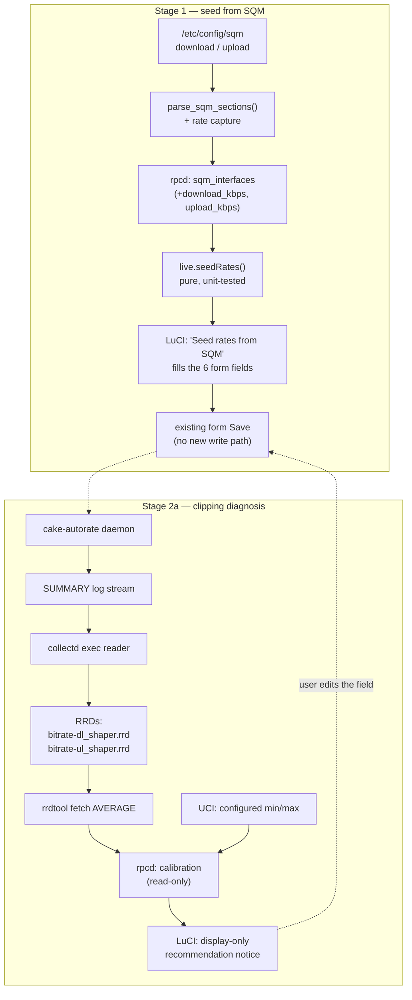
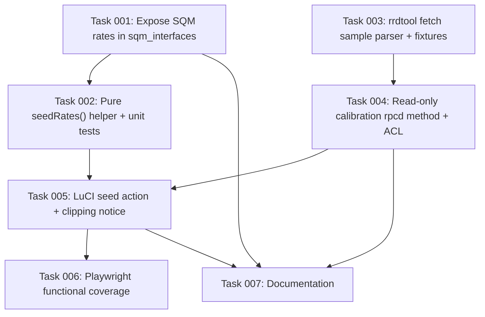

# Plan: SQM rate seeding and shaper clipping diagnosis

## Original Work Order

> Build the stats-driven calibration feature for cake-autorate-openwrt as scoped
> in docs/calibration-investigation.md (draft PR #14): Stage 1 seed min/base/max
> from SQM's configured download/upload rates via the rpcd sqm_interfaces method
> plus a LuCI "seed rates" action; Stage 2a clipping diagnosis reading the
> existing per-instance collectd RRDs with rrdtool to detect a shaper pinned at
> the configured max or floored at min during bufferbloat, surfaced as
> recommendations in LuCI. Constraints: calibration state cannot live in a
> `config cake-autorate` section (bridge unknown-key guard + Invariant 1
> coverage assertion admit only the 66 upstream options plus `enabled`); SQM owns
> the qdisc; both packages stay noarch; no new dependencies.

## Plan Clarifications

| Question | Answer |
| --- | --- |
| Should the Stage 2a clipping diagnosis write the corrected bound back to UCI, or only display it? | **Display only.** No new rpcd write method, no ACL write entry, no auto-apply. The user edits the Essentials field themselves. |
| How should the Stage 1 seed derive the six rates from SQM's configured rate? | **`base = SQM`, `max = SQM`, `min = SQM / 4`** per direction. Invents no upward headroom the user never validated; autorate may only shape *down* from the rate SQM was set to until the user raises `max` themselves. |

## Executive Summary

A fresh cake-autorate instance ships six shaper-rate numbers that fit no real
line, and the guidance for replacing them asks for facts about the link *over
time* that a new user cannot obtain on the router. This plan closes that gap
from two directions, using only information the router already holds.

First, it seeds the six rates from SQM's own configured `download` / `upload`
values. Those are numbers the user has already entered and already believes, and
the rpcd backend already parses `/etc/config/sqm` — it just discards the rates
today. Turning six blank fields into six plausible, editable ones costs one
extra parse, one client-side action, and no new dependency or write path.

Second, it reads back the daemon's own opinion of the line. The feed already
feeds per-instance collectd RRDs holding the CAKE shaper rate, and
`luci-app-cake-autorate` already hard-depends on `luci-app-statistics`, so the
RRDs and the `rrdtool` binary to read them are guaranteed present. A shaper that
has been sitting pinned at the configured `max`, or floored at `min`, is direct
evidence that the bound is wrong — and *clipping is the one signal that survives
the pipeline's lossy consolidation intact*, because the average of a clipped
constant is that constant. The result is displayed as a recommendation next to
the fields it concerns; the user remains the one who changes the value.

Both halves are read-only with respect to the system: no `tc`, no qdisc
ownership change, no new UCI keys, no new package dependency, and both packages
stay `noarch`.

## Context

### Current State vs Target State

| Current State | Target State | Why? |
| --- | --- | --- |
| A new instance shows six shaper-rate fields defaulted to values (5000/20000/80000, 5000/20000/35000) that match no real line | The Essentials tab offers a "Seed rates from SQM" action filling all six from SQM's configured rate for that interface | The largest onboarding cliff in the package; the router already holds a number the user believes |
| `parse_sqm_sections()` reads only `interface` and `enabled` from `/etc/config/sqm`, discarding `download` / `upload` | It also captures the two rates, and `sqm_interfaces` returns them per interface | The data is already being parsed past; exposing it is additive to an existing method |
| The per-instance RRDs are written and graphed, but never read back by the package | A read-only `calibration` rpcd method reads the shaper-rate RRDs and reports whether the shaper is clipped at `max` or `min` | The daemon continuously estimates line capacity; the package throws that estimate away instead of acting on it |
| A user whose `max` is set too low sees only a flat graph, with nothing telling them the bound is the cause | LuCI states plainly that the shaper was pinned at the configured bound for most of the observed window, and which field to change | Turns a diagnosis the package can already make into one it actually makes |

### Background

The reasoning behind this scope — and behind *not* building a speed test — is
recorded in `docs/calibration-investigation.md`. The load-bearing findings:

- **The stats pipeline is lossy in two places.** The collectd exec reader keeps
  one instantaneous sample per 30 s tick (`tail -n 1000 | grep '^SUMMARY; ' |
  tail -n 1`), and OpenWrt sets `RRASingle '1'` so collectd builds AVERAGE-only
  RRAs with no MIN or MAX. Peak-derived values are biased low and then averaged
  away; transient bufferbloat events are effectively invisible.
- **The shaper rate is the signal that survives**, because it is a slow-moving
  state variable rather than an instantaneous one — and clipping against a
  constant bound survives averaging exactly.
- **Consequently this plan does not condition the "floored at min" test on the
  bufferbloat load state**, as the original work order wording suggested.
  Averaging a categorical gauge (0/1/2/10/11/12) is meaningless — the mean of 2
  and 12 is 7, which denotes nothing. A shaper sitting at `min` is itself
  sufficient evidence that the controller wanted to go lower and could not; the
  load gauge adds no sound information and would add a false-precision claim.
- **RRDtool on OpenWrt is 1.0.x** (`rrdtool1` is the only rrdtool in the feed,
  and is what `luci-app-statistics` depends on). `rrdtool fetch` is available;
  `rrdtool xport` is **not** — it arrived in RRDtool 1.2. The implementation
  must parse `fetch` output.

## Architectural Approach

Two independent additions sharing one principle: read what the router already
knows, recommend, and leave the write to the user's existing Save.

### Stage 1 — Seed the six rates from SQM

**Objective**: replace six meaningless defaults with six plausible, editable
values derived from a number the user already supplied to SQM.

`parse_sqm_sections()` in `cake-autorate.rpcd` currently emits
`iface<TAB>enabled` per SQM section. It gains two more fields by capturing
`option download` and `option upload` (sqm-scripts stores both in Kbit/s, which
is already cake-autorate's unit — no conversion). `do_sqm_interfaces()` then
carries `download_kbps` / `upload_kbps` on each interface object. This is purely
additive to the method's JSON, so existing consumers are unaffected.

The seed arithmetic lives in a **pure function** in the existing unit-tested
`cake-autorate/live.js` module, not inline in the view, so it can be tested off
device alongside `live.interfaceStatus`:

- `base_dl = download_kbps`, `max_dl = download_kbps`, `min_dl = floor(download_kbps / 4)`
- `base_ul = upload_kbps`, `max_ul = upload_kbps`, `min_ul = floor(upload_kbps / 4)`

The direction mapping follows sqm-scripts: SQM's `download` is the ingress rate
(cake-autorate's `dl_*`, the IFB) and `upload` is the egress rate (`ul_*`).

In `overview.js` the Essentials tab gains a per-section **"Seed rates from SQM"**
button. It resolves the SQM section from the section's current `ul_if` (the
egress device, which is what SQM sections are keyed on), computes the six values
and writes them into the *form widgets*. The user then reviews and presses the
form's existing Save. **No rpcd write method and no ACL change**: the values
travel through the write path the form already has.

Refusal cases are explicit rather than silent — the button is disabled with a
stated reason when no SQM section matches the chosen `ul_if`, or when the
matching section's rate is `0` (sqm-scripts' "no limit" sentinel, which carries
no information to seed from).

### Stage 2a — Clipping diagnosis from the existing RRDs

**Objective**: tell the user when a configured bound, not the line, is what is
limiting them.

A new **read-only** rpcd method `calibration` takes an instance id and returns a
per-direction verdict. It:

1. Resolves the RRD directory. collectd's layout is
   `<DataDir>/<host>/<plugin>-<plugin_instance>/<type>-<type_instance>.rrd`, and
   the exec reader sets the plugin instance to the cake-autorate instance id, so
   the files are
   `<DataDir>/<host>/cake_autorate-<instance>/bitrate-{dl,ul}_shaper.rrd`.
   `DataDir` is read from the `luci_statistics` UCI config, defaulting to
   `/tmp/rrd`.
2. Runs `rrdtool fetch <file> AVERAGE` over a bounded window and parses the
   `timestamp: value` rows, skipping `nan`. **`fetch`, not `xport`** — see
   Background.
3. Reads the instance's configured `min_*`/`max_*` from UCI and computes, per
   direction, the fraction of valid samples sitting within a small tolerance of
   the configured `max` (pinned high) and of the configured `min` (floored low).
4. Returns a verdict plus the evidence behind it (sample count, window actually
   covered, fractions), so the UI can state *why* rather than assert.

It follows the degradation style the existing `status` method already
establishes: a missing `rrdtool`, a missing RRD, or a window with no valid
samples returns `{"available":false,"reason":…}` rather than an error, because
"statistics have not accumulated yet" is a normal state on a fresh install.

Testability follows the backend's existing convention of `CAKE_AUTORATE_*`
environment overrides for filesystem paths (as `CAKE_AUTORATE_SQM_CONFIG` and
`CAKE_AUTORATE_NET_DIR` already do), so `tests/rpcd/test-rpcd.sh` can point the
method at a fixture directory and a stub `rrdtool` and assert the arithmetic and
every degradation path without a live collectd.

The ACL gains `calibration` in its **read** ubus list only.

In LuCI, the result is rendered as a display-only notice on the Essentials tab,
seeded per section after render — the same pattern `updateIfWarning` already uses
for the interface warnings. It names the field to change and the value the
evidence supports, and it is a recommendation, never a control.

## Risk Considerations and Mitigation Strategies

Technical Risks

- **RRDtool 1.0.x behaviour differs from modern rrdtool.** `xport` is absent and
  `fetch` output formatting is of its era.
    - **Mitigation**: use `fetch` only; parse defensively (tolerate `nan`/`NaN`,
      exponent formatting and varying whitespace); assert the parse against
      captured fixture output in the unit suite, and confirm the real invocation
      on-device in the VM integration harness rather than trusting the fixture.
- **RRD history is shorter than assumed.** `DataDir` defaults to `/tmp/rrd`, so
  history is since-boot unless the user moved `rrd_storage_path` to persistent
  storage.
    - **Mitigation**: report the window actually covered and the sample count
      alongside every verdict, and suppress a verdict entirely below a minimum
      sample count rather than inferring from a handful of points.
- **A clipping verdict could be drawn from an idle link.** A shaper resting at
  `max` while nothing is being transferred is not evidence the bound is wrong.
    - **Mitigation**: require a meaningful number of valid samples and state the
      evidence in the UI so the user can discount it; do not offer an apply
      action (already excluded by the clarification).

Implementation Risks

- **Touching `sqm_interfaces` could regress the interface pickers**, which the
  config form and its Playwright suite depend on.
    - **Mitigation**: the change is strictly additive to the returned JSON;
      existing assertions in `tests/rpcd/test-rpcd.sh` must continue to pass
      unmodified, which is the regression signal.
- **Scope creep into Stage 2b or an apply action.** The neighbouring ideas
  (enriching the collectd reader with per-interval aggregates; one-click apply)
  are deliberately out of scope.
    - **Mitigation**: both are excluded here by explicit decision; the collectd
      reader and the `SUMMARY` field contract are **not** modified by this plan,
      so `tests/statistics/test-collectd-parser.sh` should be untouched and
      green.
- **Accidentally introducing UCI state.** Any new key in a `config cake-autorate`
  section is fatal — the bridge's unknown-key guard skips the section and the
  Invariant 1 coverage assertion fails.
    - **Mitigation**: the design is stateless by construction — seeding writes
      only the six existing rate keys, and the diagnosis persists nothing.
      `tests/bridge/test-bridge.sh` and `tests/schema/test-uci-schema.sh` staying
      green is the check.

## Success Criteria

### Primary Success Criteria

1. `sqm_interfaces` returns SQM's configured `download`/`upload` per interface,
   with every pre-existing field and assertion unchanged.
2. A new instance whose `ul_if` matches a rate-configured SQM section can have
   all six shaper rates filled by one action, producing `base = SQM`,
   `max = SQM`, `min = floor(SQM / 4)` per direction, and the action is disabled
   with a stated reason when no rate is available.
3. A read-only `calibration` rpcd method reports, per direction, whether the
   shaper has been clipped at the configured `max` or `min`, together with the
   sample count and window covered, and degrades to
   `{"available":false,"reason":…}` when rrdtool, the RRD, or the data is
   missing.
4. LuCI displays that verdict against the relevant Essentials fields as a
   recommendation, with no control that writes it.
5. The full off-device suite and the VM integration harness pass, and both
   packages still build `noarch` with no dependency added to either Makefile.

## Self Validation

Run after all tasks complete:

1. `tests/bridge/test-bridge.sh`, `tests/schema/test-uci-schema.sh`,
   `tests/rpcd/test-rpcd.sh`, `tests/service/test-init.sh`,
   `tests/statistics/test-collectd-parser.sh`,
   `tests/regression/test-libuci-nounset.sh` — all six exit 0. The collectd
   parser suite must pass **without modification**, proving the `SUMMARY`
   contract was not disturbed.
2. `node luci/luci-app-cake-autorate/tests/live.test.js` and
   `node luci/luci-app-cake-autorate/tests/options-coverage.test.js` — both exit
   0, including new cases for the seed arithmetic covering a normal rate, a `0`
   rate and a missing section. (These two suites are plain `node` scripts and are
   presently wired into neither CI nor `docs/testing.md`; that pre-existing gap
   is **not** in scope here, so they are run explicitly.)
3. `grep -c DEPENDS net/cake-autorate/Makefile luci/luci-app-cake-autorate/Makefile`
   and diff the dependency lines against `origin/main` — expect no change.
4. `./tests/integration/run.sh` — passes. In the VM, invoke the new method
   directly and show real output:
   `ubus call cake-autorate calibration '{"instance":"primary"}'` — expect valid
   JSON, either a verdict or an `available:false` reason.
5. In the VM, confirm the rrdtool assumption against the real binary rather than
   the fixture: `rrdtool fetch <an actual cake_autorate RRD> AVERAGE` returns
   parseable rows, and `rrdtool xport` is confirmed absent/unsupported.
6. `cd tests/ui && npx playwright test --project=functional` — passes, including
   a new assertion that the seed action fills the six fields and that the
   calibration notice renders. Capture a screenshot of the Essentials tab
   showing both the seed control and a clipping notice.

## Documentation

- `docs/configuration.md` — document the seed action (including the
  `base`/`max`/`min` formula and when it refuses) and the calibration notice.
- `docs/calibration-investigation.md` — update the status line so it no longer
  reads "investigation only": Stage 1 and Stage 2a are implemented; Stage 2b and
  the active test remain unbuilt.
- `AGENTS.md` — extend the rpcd object bullet to list the `calibration` method
  and its read-only nature.

## Resource Requirements

### Development Skills

POSIX/BusyBox shell for the rpcd backend and its test fixtures; LuCI client-side
JavaScript (`form`/`ui`/`rpc`) for the view and the pure helper; awk for the
`rrdtool fetch` parse; Playwright for the UI assertions.

### Technical Infrastructure

No new runtime dependency. `rrdtool` (from `rrdtool1`) and the RRDs arrive via
the existing hard dependency on `luci-app-statistics`. Local development needs
the existing test tooling; the VM integration and Playwright suites need QEMU and
`/dev/kvm`.

## Integration Strategy

Both additions attach to existing seams rather than creating new ones: the seed
extends a method and a form that already exist and reuses the form's own save
path, and the diagnosis adds one read-only method beside `status` following the
same degradation contract. The daemon, the bridge, the UCI schema, the collectd
reader and the `SUMMARY` field contract are all untouched.

## Notes

- Explicitly **out of scope**: Stage 2b (enriching the collectd exec reader with
  per-interval aggregates), any apply/auto-write of a recommendation, the active
  speed test, and tuning of the OWD delta thresholds. Threshold tuning depends on
  the per-interval aggregates from Stage 2b and cannot be done soundly from
  today's AVERAGE-only RRDs.
- The seed deliberately sets `max = SQM` rather than inflating it. If the line
  genuinely exceeds the SQM rate, raising `max` is a decision the user makes with
  their own knowledge — and the Stage 2a clipping diagnosis is precisely what
  will tell them it is time to.

## Execution Blueprint

**Validation Gates:**
- Reference: `/config/hooks/POST_PHASE.md`

### Dependency Diagram

No circular dependencies: every edge runs from a lower task id to a higher one,
so the graph is acyclic by construction.

### ✅ Phase 1: Independent backend groundwork
**Parallel Tasks:**
- ✔️ Task 001: Expose SQM's configured download/upload rates from `sqm_interfaces` — `completed`
- ✔️ Task 003: Parse `rrdtool fetch` output into a stream of valid samples — `completed`

> **Deviation:** run **sequentially**, not in parallel. Both tasks edit
> `cake-autorate.rpcd` and append to `tests/rpcd/test-rpcd.sh`; concurrent agents
> would have raced on the same two files. Correctness over parallelism.
>
> **Outstanding:** task 003's fixtures encode the *expected* RRDtool 1.0.x
> `fetch` shape — no rrdtool binary exists in the build environment, so fidelity
> to the real binary is unproven and remains Self Validation step 5 (on-device,
> in the VM).

### ✅ Phase 2: Consumers of the two contracts
**Parallel Tasks:**
- ✔️ Task 002: Pure `seedRates()` helper and unit tests (depends on: 001) — `completed`
- ✔️ Task 004: Read-only `calibration` rpcd method and ACL entry (depends on: 003) — `completed`

> Ran genuinely in parallel — task 002 owns only the two JavaScript files and
> task 004 only the shell/ACL/test files, so there was no shared-file hazard.
>
> **Note:** `cmd_call` parses the request JSON with `jsonfilter`, which is
> OpenWrt-only, so the `calibration` method cannot be exercised through
> `… call calibration` off device. Verified instead by sourcing the backend with
> `CAKE_AUTORATE_RPCD_LIB=1` and calling `do_calibration` directly. Not a defect —
> but it means the dispatch path itself is only covered on device.

### ✅ Phase 3: User interface
**Parallel Tasks:**
- ✔️ Task 005: "Seed rates from SQM" action and clipping notice on the Essentials
  tab (depends on: 002, 004) — `completed`

> Decision logic was pushed down into two new pure helpers in `live.js`
> (`seedPlan`, `calibrationReport`) and unit-tested; only the DOM/framework
> wiring is left to Playwright, per the project's test philosophy. `live.test.js`
> grew 23 → 40 tests.
>
> **Known limitation:** the notice does not survive a map re-render (Save & Apply
> or Add instance replaces the section DOM); a reload restores it. This is the
> same limitation the existing `updateIfWarning` interface warnings already have.
> The seed control self-heals, since its widget recomputes.
>
> **Follow-on for Phase 4:** the Essentials tab gained a button and a notice, so
> the committed visual baselines under
> `tests/ui/visual/02-config-form.spec.js-snapshots` will need regenerating.

### Post-phase Actions

Both Phase 1 tasks and Task 004 edit `net/cake-autorate/files/cake-autorate.rpcd`
and `tests/rpcd/test-rpcd.sh`. Tasks 001 and 003 touch disjoint regions (the SQM
parser vs. a new sample helper), but after Phase 1 confirm the file is coherent
and `tests/rpcd/test-rpcd.sh` passes as a whole before Phase 2 begins.

Task 005 is alone in Phase 3 deliberately: both UI additions land in
`overview.js`, so no other task may edit that file concurrently.

### Phase 4: Verification and documentation
**Parallel Tasks:**
- Task 006: Playwright functional coverage for both UI additions (depends on: 005)
- Task 007: Documentation — `docs/configuration.md`,
  `docs/calibration-investigation.md`, `AGENTS.md` (depends on: 001, 004, 005)

### Execution Summary
- Total Phases: 4
- Total Tasks: 7
